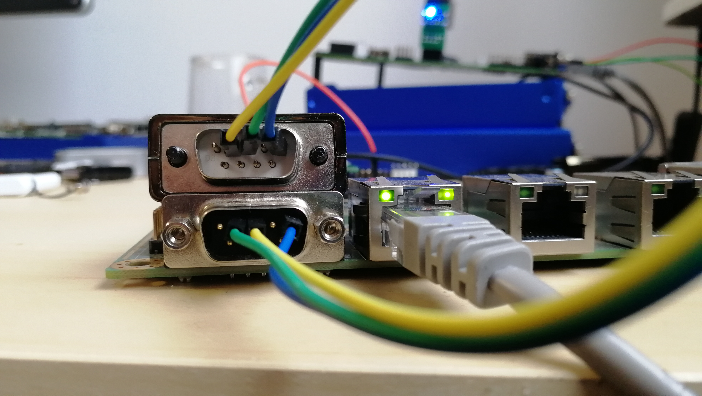

Flashing APUx with Raspberry Pi
==============================

# Preparing environment and building image

Details about building firmware are mentioned in [README](https://github.com/pcengines/apu2-documentation#building-firmware-using-pc-engines-firmware-builder)

# Flashing APUx using RPi2/3/zero

If You have already built an image with descriptions provided earlier, it is
time to connect RPi to apu.

1. Prepare wire connections.

    pinout:

    | Signal     | RPi Pin number | APUx SPI pin header      |
    |------------|----------------|-------------------------|
    | 3V power   | 17             | 1 VCC (may be omitted)  |
    | GND        | 20             | 2 GND                   |
    | SPI0 CS0   | 24             | 3 SPICS                 |
    | SPI0 CLK   | 23             | 4 SPICLK                |
    | SPI0 MISO  | 21             | 5 SPIDI                 |
    | SPI0 MOSI  | 19             | 6 SPIDO                 |

    > Except that before flashing we have to make sure that APUx is on and
      in S5 state. That means we have to connect pins 2 and 3 on J2 header
      before turning power on. In such case there will be no output on serial
      port.

2. Configure SPI and SSH on RPi.

  On RPi side we can use other pins as well. There are 2xSPI, 2x3V power and
  8xGND. Note that SPI requires `dtoverlay=spi1-1cs` in `/boot/config.txt`:

  * I have Raspbian on SD card, I need additional customizations:
  * if /dev/spidev0.0 doesn't exist, set `dtparam=spi=on` in `boot/config.txt`,
    reboot.
  * I want to connect via WiFi/SSH. So I place config `wpa_supplicant.conf`
    `/boot/` (`/etc/wpa_supplicant/` should work as well).
  * enable SSH on boot (in `/etc/rc.local`):

  ```sh
      /etc/init.d/ssh start
  ```

  * To figure out RPi's IP address I use:

  ```sh
      ~/img> sudo nmap -sP 192.168.0.255/24

      [...]
      Nmap scan report for 192.168.0.16
      Host is up (0.17s latency).
      MAC Address: B8:27:EB:24:81:58 (Raspberry Pi Foundation)
      [...]
  ```

  > Be carefull, you may need to adjust IP address mask!

  * I can login on pi user (default password: raspberry), which
    has sudo priviledges:

  ```sh
      ssh pi@192.168.0.16
  ```

  * install flashrom

  ```sh
      pi@raspberrypi:~$ sudo apt-get install flashrom
  ```

  * read ROM image:

  ##### APU1
  ```sh
      pi@raspberrypi:~$ sudo flashrom -p linux_spi:dev=/dev/spidev0.0,spispeed=16000 -r apu.rom -c "MX25L1605A/MX25L1606E/MX25L1608E"
  ```

  ##### APU2/3/4/5:

  ```sh
      pi@raspberrypi:~$ sudo flashrom -p linux_spi:dev=/dev/spidev0.0,spispeed=16000 -r apu.rom
  ```
3. Connecting via serial port:

  * RS232 connection - according to the image (TX & RX crossed)

  

  Terminal command:

  ```sh
  sudo screen -L /dev/ttyUSB0 115200,-cstopb
  ```
