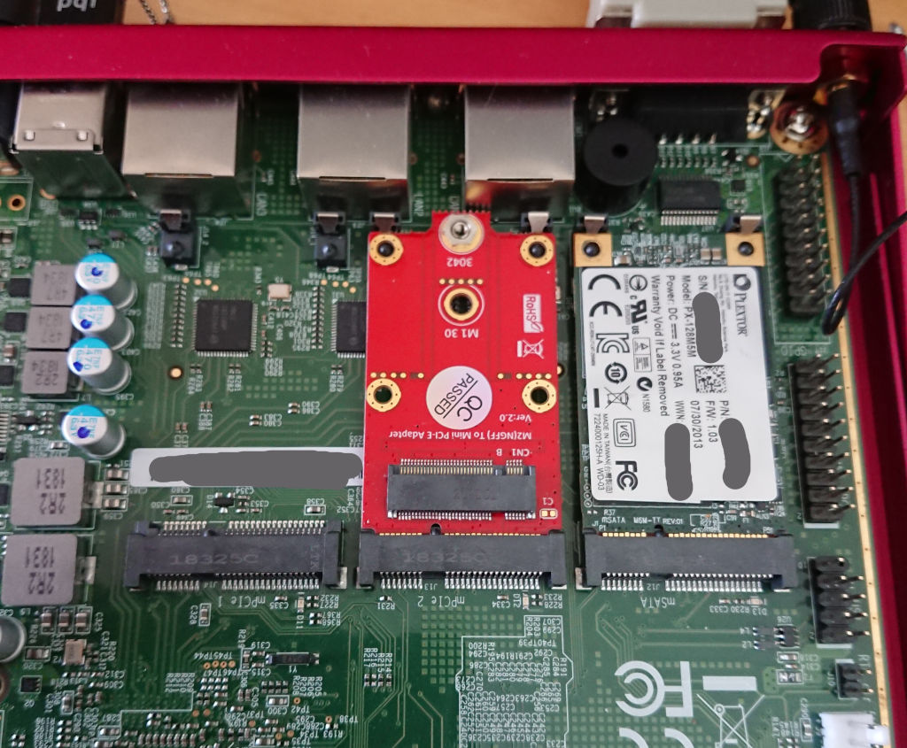
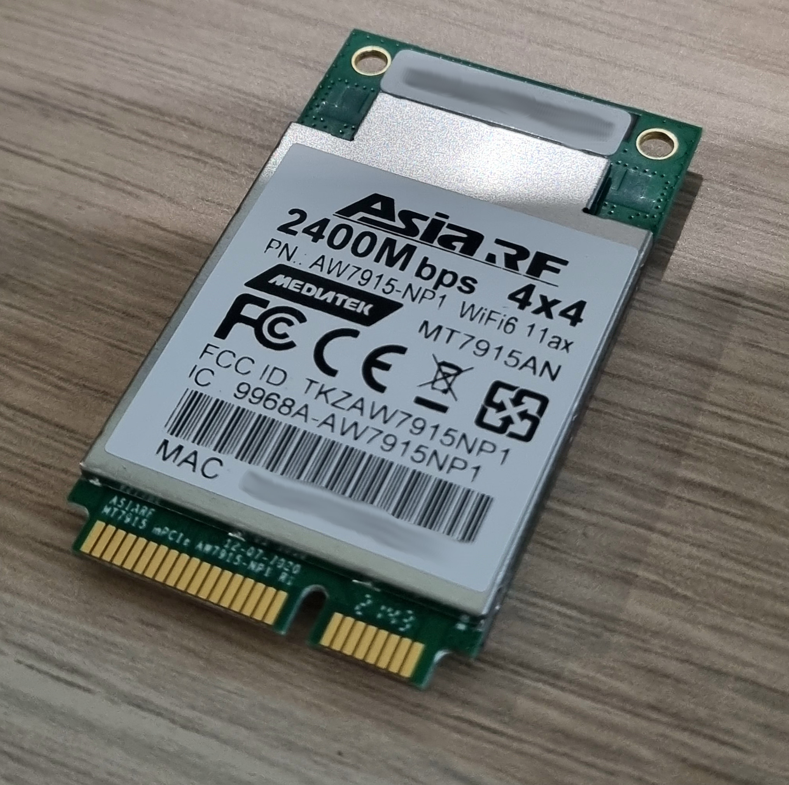

List of supported mPCIe modules
===============================

This document contains a list of supported WiFi and LTE modules in mini PCI
Express card form factor. Document intends to present limitations of the
modules and quirks necessary for their flawless operation.

> The list is currently limited only to tested and verified modules

## LTE modules

> Note: By default, in apu3/4, the SIM card slots are "crossed", that is to say,
> the left SIM slot is wired to the mSATA slot and the right SIM slot is wired
> to the mPCIe2 slot. You can swap the SIM slots on the fly using GPIO 410 -
> follow [the GPIO documentation](gpios.md) for detailed instructions.

### Quectel EP06


This LTE module has certain problems with detection in the operating systems.
The module uses a USB interface to communicate with the processor and OS. Due
to the availability of USB 2.0 and USB 3.0 interfaces in the module, it often
gets enumerated incorrectly. The presence of USB 3.0 lanes causes the module to
use the USB 3.0 protocol instead of the USB 2.0 protocol. The mPCIe slots on
apu boards have only USB 2.0 signals routed to the connectors. In place of the
USB 3.0 signals, apu boards have either PCIe signals or SATA signals for WiFi
and mSATA modules respectively. The design of the modules is intended to
support majority of the modules, but it will not always be compatible with all
possible modules, please take it into consideration.

**Symptoms of the wrong detection:**

- only 1 ttyUSB node created by OS
- no ttyUSB nodes created by OS
- errors in USB enumeration for the module in dmesg

**Solutions:**

1. Contact PC Engines for a module firmware update with USB 3.0 protocol
   disabled if You have problems with module detection.
2. Cover USB 3.0 signals on the module with tape to block signal connection as
   shown in the picture:


Black pins mean that they have to be covered with tape. The 6 black pins on
the top side are USB3.0 signals. Two pins on the bottom side are I2C/SMBus pins
which also should be covered with tape. The module design requires pull-ups on
the mainboard side, but they are not present on apu.

**Compatible slots:**

| Platform |  mPCIe1  |  mPCIe2  |     mSATA      |
|:--------:|:--------:|:--------:|:--------------:|
|   apu2   | &#10004; | &#10004; | &#10006;       |
|   apu3   | &#10006; | &#10004; | &#10004; &sup1;|
|   apu4   | &#10006; | &#10004; | &#10004; &sup1;|

(1) Do not forget to enable EHCI0 controller in sortbootorder

> For each port's capabilities please refer to [mPCIe port capabilities](APU_mPCIe_capabilities.md)

### HUAWEI ME909u


This module works fairly well with all apu boards.
But be aware that due to its [buggy firmware](https://forum.openwrt.org/t/cdc-ether-ethertype-unknown-0x0808-on-huawei-me909u-521/5509),
[LTE may not work in some conditions](https://gitlab.freedesktop.org/mobile-broadband/ModemManager/-/issues/635#note_1576091)
with the default `cdc_ether` driver selected by `usb_modeswitch`.
You may have more success using the `qmi_wwan` driver
(`echo Configuration=1 >/etc/usb_modeswitch.d/12d1:1573`)
which implements a workaround in [qmi_wwan_rx_fixup()](https://github.com/torvalds/linux/blob/v5.19/drivers/net/usb/qmi_wwan.c#L542-L561).

**Compatible slots:**

| Platform |  mPCIe1  |  mPCIe2  |     mSATA      |
|:--------:|:--------:|:--------:|:--------------:|
|   apu2   | &#10004; | &#10004; | &#10006;       |
|   apu3   | &#10006; | &#10004; | &#10004; &sup1;|
|   apu4   | &#10006; | &#10004; | &#10004; &sup1;|

(1) Do not forget to enable EHCI0 controller in sortbootorder

### HUAWEI ME906s M.2

There is an option to use the M.2 Key B to Mini PCIE PCI-E Adapter Converter
for 3G/4G/5G and connect Huawei ME906s M.2 4G to compatible mPCIe slot. This
adapter includes routing the SIM signals so APU SIM slot may be used without
problems.

Kudos to Jamie Lentin (@lentinj) for checking this.




**Compatible slots:**

| Platform |  mPCIe1  |  mPCIe2  |     mSATA      |
|:--------:|:--------:|:--------:|:--------------:|
|   apu2   | &#10004; | &#10004; | &#10006;       |
|   apu3   | &#10006; | &#10004; | &#10004; &sup1;|
|   apu4   | &#10006; | &#10004; | &#10004; &sup1;|

(1) Do not forget to enable EHCI0 controller in sortbootorder

## WiFi modules

### WLE200NX


This module works fairly well with all apu boards. The module may have issues
with interrupts. Related issues:

- [coreboot #206](https://github.com/pcengines/coreboot/issues/206)
- [coreboot #285](https://github.com/pcengines/coreboot/issues/285)
- [coreboot #323](https://github.com/pcengines/coreboot/issues/323)

**Compatible slots:**

| Platform |  mPCIe1  |  mPCIe2  |  mSATA   |
|:--------:|:--------:|:--------:|:--------:|
|   apu2   | &#10004; | &#10004; | &#10006; |
|   apu3   | &#10004; | &#10006; | &#10006; |
|   apu4   | &#10004; | &#10006; | &#10006; |

**Quirks:**

The real culprit of interrupt routing problems is the ath9k kernel module
responsible for WLE200NX operation. The module has no robust interrupt
implementation and tries to remap legacy INTx interrupt with IOMMU which is not
possible due to technical reasons. The correct solution is to force ath9k
kernel module to use MSI interrupts which can be remapped. This can be done
with:

```
echo "options ath9k use_msi=1" | sudo tee -a /etc/modprobe.d/ath9k.conf
```

When the module is loaded, it initializes interrupts coming from WiFi devices
to be a MSI type. MSI interrupts are correctly remapped by kernel with IOMMU,
thus the issue is not present.

Other solutions with kernel command line options:

- `amd_iommu=off` - disables the use of IOMMU in kernel.
- `intremap=off` - disables security feature of IOMMU called interrupt
  remapping.

### WLE600VX


This module works fairly well with all apu boards. Tested by PC Engines and apu
users.

**Compatible slots:**

| Platform |  mPCIe1  |  mPCIe2  |  mSATA   |
|:--------:|:--------:|:--------:|:--------:|
|   apu2   | &#10004; | &#10004; | &#10006; |
|   apu3   | &#10004; | &#10006; | &#10006; |
|   apu4   | &#10004; | &#10006; | &#10006; |

**Quirks:**

- Sometimes the module may have problems with OS communication on mainline
  releases. In such case providing `amd_iommu=off` to kernel command line may
  help.

### WLE900VX


This module works fairly well with all apu boards.

**Compatible slots:**

| Platform |  mPCIe1  |  mPCIe2  |  mSATA   |
|:--------:|:--------:|:--------:|:--------:|
|   apu2   | &#10004; | &#10004; | &#10006; |
|   apu3   | &#10004; | &#10006; | &#10006; |
|   apu4   | &#10004; | &#10006; | &#10006; |

**Quirks:**

- Sometimes the module may have problems with OS communication on mainline
  releases. In such case providing `amd_iommu=off` to kernel command line may
  help.

### WLE1216V5-20


Correct detection of this module is a little tricky and hardware related. Due
to different PCI Express reset circuit on apu boards, apu2 has problems with
this particular module detection. Most likely due to different reset timing
caused by different `PE_RST` circuitry on apu2, the module does not come out
of reset in time during PCI enumeration and thus is not detected in BIOS and
operating system.

**Quirks:**

- On apu2 in mPCIe2 slot module works only after a soft reboot with legacy
  firmware, however during the tests we have encountered kernel panics. On the
  other hand users did not experience kernel panics and are able to use the
  module after reboot. The apu2 board revision plays a huge role in the
  mentioned problems.
- on apu3 and apu4 the module works with any firmware and does not require
  reboot

| Platform |  mPCIe1  |     mPCIe2      |  mSATA   |
|:--------:|:--------:|:---------------:|:--------:|
|   apu2   | &#10006; | &#10004; &sup1; | &#10006; |
|   apu3   | &#10004; | &#10006;        | &#10006; |
|   apu4   | &#10004; | &#10006;        | &#10006; |

(1) Refer to quirks, it is known to not work stably on all apu2 board revisions

### AW7915-NP1



The AW7915-NP1 is a MediaTek MT7915E based Wi-Fi 6 (802.11ax) card from AsiaRF.
It features 4x4 MIMO and support for 160MHz channels, and a maximum theoretical
bandwidth of 2400 Mb/s. In the apu2, the card can reach over 1Gb/s transfer
speeds in ideal conditions.

This module has been tested to work reliably in an apu2c4 board running OpenWRT
21.02.02. No firmware tweaks are necessary for correct operation.

The card gets hot under sustained operation, easily reaching over 130 degrees
celsius if not cooled sufficiently. A heatsink is recommended, the card does
not come with one.

| Platform |  mPCIe1  |     mPCIe2      |  mSATA   |
|:--------:|:--------:|:---------------:|:--------:|
|   apu2   | &#10004; | &#10004;        | &#10006; |
|   apu3   | &#10004; | &#10006;        | &#10006; |
|   apu4   | &#10004; | &#10006;        | &#10006; |

## Ethernet controllers

### Dual Ethernet Controller Realtek RTL8111


**Compatible slots**

| Platform |  mPCIe1  |     mPCIe2      |  mSATA   |
|:--------:|:--------:|:---------------:|:--------:|
|   apu2   | &#10004; | &#10004; &sup1; | &#10006; |
|   apu3   | &#10004; | &#10006;        | &#10006; |
|   apu4   | &#10004; | &#10006;        | &#10006; |

(1) If RTL8111 is attached to mPCIe2 slot then option *force mPCIe2 slot Clk* in
Payload menu must be enabled

This model works well with apu1 boards. However, on apu2, apu3 and apu4
platforms following steps should be done to correctly enable it:

1. On apu2 board (apu1, apu3 and apu4 boards aren't affected) make sure to
enable option *force mPCIe2 slot Clk* in Payload menu if you attached module to
mPCIe2 slot. This menu is available during boot process by pressing `F10`
button. In OS now, you should be able to see your Ethernet controller under PCI
devices.

2. Manually download and install missing Realtek firmware. Even if Ethernet
controller is recognized by OS it won't work correctly without it. Installation
can be done, for example in Debian OS, by performing those steps:

    - Edit `/etc/apt/sources.list` file. It should contain additional two
    lines:
    ```
    deb http://ftp.pl.debian.org/debian stretch main non-free
    deb-src  http://ftp.pl.debian.org/debian stretch main non-free
    ```
    - Update apt-get:
    ```
    sudo apt-get update
    ```
    - Install Realtek firmware
    ```
    sudo apt-get install firmware-realtek
    ```

## SATA controllers

### ASMedia ASM1061

Module is NOT SUPPORTED by PC Engines apu platforms. ASM1061 was tested with
Delock 95233 mPCIe 2xSATA module.


**Compatible slots**

Due to apu boards construction, it is possible to test that module only under
apu2 mPCIe2 slot. Capacitors placed near the mPCIe1 slot prevent connecting the
SATA cables to the module. Therefore, module was tested only in mPCIe2 slot.
After multiple tests performed, it turned out that ASM1061 module is not
supported by PC Engines apu2 platform.

**Tests results**

Carried out tests and their results are presented in [debug documentation](debug/mpcie2.md).
Detection problem is described more precisely there. Also, possible reasons
of ASM1061 behavior are presented. Anyway, in every case and configuration
that module doesn't work properly.

## Other hardware fixes

A good source of hardware fixes information of Your board is the
[PC Engines site](https://pcengines.ch/).

If You think Your problem may be related to issues listed here, contact PC
Engines for details.

If You have not found a solution either after reading this document or
contacting PC Engines, feel free to open [GitHub issue.](https://github.com/pcengines/coreboot/issues)

### apu2

Set of changes for apu2:

**Version apu2d:**

- Reduce leakage current between V3 and V3A power rails (can cause problems
  with SD cards).
- Add options for better compatibility with LTE modem modules.

**Version apu2c:**

- Integrate blue wire patches (EMI, power-up circuit) into PCB fab.

### apu3

Set of changes for apu3:

**Version apu3c:**

- Improve compatibility with LTE modem modules: Disconnect SMB_DAT / SMB_CLK
  signals (1.8V level on Quectel).
- Improve compatibility with LTE modem modules: No stuff diodes D4 / D17,
  option resistor bypass (extremely low VIL on Huawei modems, sensitive to
  incoming EMI).
- Optional SIM presence indicator / SIM card detect.
- Disable non-functional NCT5104D watchdog timer.
- Increase 3.3V current limit to allow for two simultaneous LTE modems.
- Some DFM changes.

**Version apu3b:**

- Fixed USB header J13 pinout.

**Version apu3a:**

- The pinout on USB header J13 is wrong, do not use.

### apu4

Set of changes for apu4:

**Version apu4c:**

- Minimize leakage from V3A to V3 rail (SD card compatibility)
- Fix USB header J12 pinout.
- Change SIM switch to FXLA2203, FXLA2204 went EOL.
- New 2GB version apu4c2, single SIM socket.
- Optional 10 pin LPC header to allow for future TPM option.
