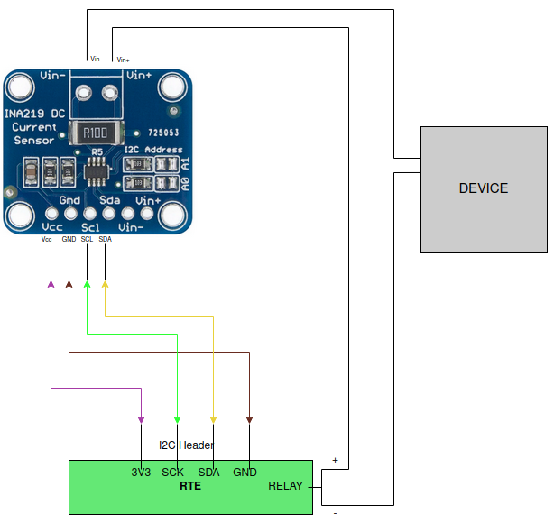

# Power Consumption

## Intro

We decided to take a closer look at the occurrence of energy consumption on apu
platforms. Measuring energy is valuable if we strive to improve the firmware.
Thanks to this information, we are also able to detect errors quickly.

## Setup testing environment

Measuring power consumption is possible thanks to the connection of
[RTE](https://docs.dasharo.com/transparent-validation/rte/introduction/) with
the [INA219](https://download.kamami.pl/p564714-ina219.pdf) sensor.RTE stands
for Remote Testing Environment and it is a tool that helps to debug and test
devices. RTE could be replaced by another device with an I2C header, but rest
assured it works with RTE. The INA219 is a current shunt and power monitor.
Connect RTE I2C header (J9) with the INA219 I2C header to read from the sensor.

 RTE I2C header (J9)        | INA219 I2C header
:--------------------------:|:---------------------------:
 1 (3V3)                    | (Vcc)
 2 (SCK)                    | (SCL)
 3 (SDA)                    | (SDA)
 4 (GND)                    | (GND)

Then you have to cut one of the wires in the power cable going from the RTE to
the device. We should cut the plus so the part from RTE is should be connected
to Vin+, and the part from the device to Vin-. 



The values ​​from the sensor in the tests are normally read every 0.5s, but it is
a modifiable value. From the sensor, you can read information about voltage(V),
current(A) and power(W). We read the values with the following commands:

```bash
cat /sys/class/hwmon/hwmon0/in1_input
cat /sys/class/hwmon/hwmon0/curr1_input
cat /sys/class/hwmon/hwmon0/power1_input
```

## Tests

### Apu stress-test CPU

A test case is following:

1. Power on RTE and power on apu3.
2. Boot to Debian 10 (buster) with kernel 4.19 on apu3.
3. Start measurements on RTE: constantly measure *bus voltage*, *current* and
   *input power* in 0.5 seconds time intervals and save them to a text file.
4. After 10 seconds from starting measurements, invoke `sysbench` command on
apu3.
5. When `sysbench` is finished, wait ~25 seconds and invoke the command again.
6. When `sysbench` command was invoked 10 times, finish the entire test.

## Presentation of the results

The test results are presented as charts based on the values ​​obtained during the
tests. Graphs or simple information on power consumption are available in the
PC-ENGINES newsletter.

## Future plans for tests

In the future, we could focus on test development and measurement performed:

* at the start of the device

* during the memtest

* when the platform is constantly restarted
