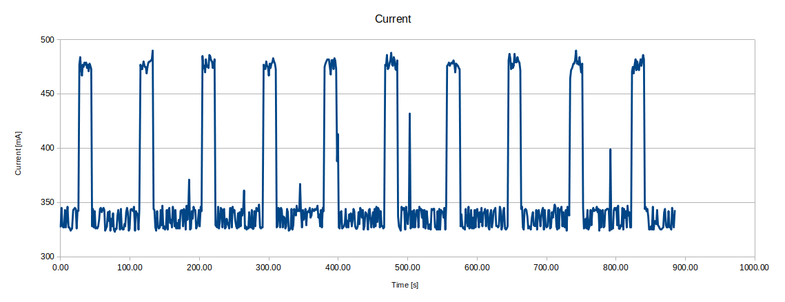
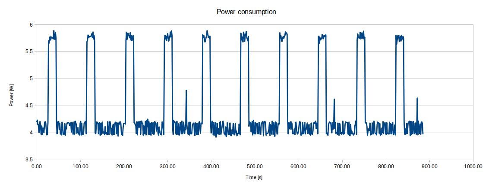

# PC Engines apu3 power consumption tests

We have started research and measurements of power consumption on apu platforms.
Our goal is to optimize (if possible) power management on coreboot level. First
stage of work is to collect data from various tests and create reports. For that
purpose we have used RTE with power monitor sensor. RTE stands for *Remote
Testing Environment* and it is a tool which helps debugging and testing devices.
RTE gathers all necessary interfaces and ports in one device. Therefore, it is
very versatile and convenient to use. More information can be found on
[3mdeb official website](https://shop.3mdeb.com/product/rte/). It is also place
where you can buy it.

This document gathers all already carried out tests, their results and our
conclusions. Over time, we will conduct next tests and hence extend this
document with further reports.

## Tests

### apu3 stress-test cpu

Test case is following:

1. Power on RTE and power on apu3.
2. Boot to Debian 10 (buster) with kernel 4.19 on apu3.
3. Start measurements on RTE: constantly measure *bus voltage*, *current* and
   *input power* in 0.5 seconds time intervals and save them to text file.
4. After 10 seconds from starting measurements, invoke `sysbench` command on
apu3.
5. When `sysbench` finished, wait ~25 seconds and invoke command again.
6. When `sysbench` command was invoked 10 times, finish entire test.

#### Results with coreboot v4.11.0.4

Above test was performed with `coreboot v4.11.0.4` which doesn't have **ASPM**
(Active State Power Management) enabled. This feature was introduced in
v4.11.0.5 release.

```bash
$ sysbench cpu run --threads=4 --events=10000 --cpu-max-prime=20000 --time=0 --validate
sysbench 1.0.19 (using bundled LuaJIT 2.1.0-beta2)

Running the test with following options:
Number of threads: 4
Validation checks: on.

Initializing random number generator from current time


Prime numbers limit: 20000

Initializing worker threads...

Threads started!

CPU speed:
    events per second:   539.76

General statistics:
    total time:                          18.5220s
    total number of events:              10000

Latency (ms):
         min:                                    6.40
         avg:                                    7.41
         max:                                    8.13
         95th percentile:                        7.70
         sum:                                74064.78

Threads fairness:
    events (avg/stddev):           2500.0000/18.61
    execution time (avg/stddev):   18.5162/0.00
```






##### Conclusions

In idle state, when only Debian is running without any commands and
applications, power consumption oscillates around 4W. It increases to almost 6W
(~5.8W) when `sysbench` is running. That change is mainly caused by current
rise. However, simultaneously there is a little voltage drop on the bus. As you
can see it drops from about 12.18 V to 12.12 V. That behavior is normal - the
greater the load, the greater voltage decrease can be observed. It is rather
related to quality of power supply and wires than to end device. Moreover, as
this voltage drop is slight, it can be omitted in analysis.

#### Results with coreboot v4.11.0.5

Above test was repeated with `coreboot v4.11.0.5` which has **ASPM** (Active
State Power Management) enabled. Exactly same test case was carried out and same
measurements were taken.

```bash
$ sysbench cpu run --threads=4 --events=10000 --cpu-max-prime=20000 --time=0 --validate
sysbench 1.0.19 (using bundled LuaJIT 2.1.0-beta2)

Running the test with following options:
Number of threads: 4
Validation checks: on.

Initializing random number generator from current time


Prime numbers limit: 20000

Initializing worker threads...

Threads started!

CPU speed:
    events per second:   539.80

General statistics:
    total time:                          18.5200s
    total number of events:              10000

Latency (ms):
         min:                                    6.36
         avg:                                    7.41
         max:                                    8.17
         95th percentile:                        7.70
         sum:                                74053.97

Threads fairness:
    events (avg/stddev):           2500.0000/18.79
    execution time (avg/stddev):   18.5135/0.00
```


##### coreboot v4.11.0.4 vs v4.11.0.5

Comparing those results to previous one (with `coreboot v4.11.0.4`), following
differences can be noticed:

- average bus voltage level in idle state and during stress-test is slightly
  larger with `coreboot v4.11.0.5` than `coreboot v4.11.0.4`; however, those
  differences are only about 0,01/0,02 V, which makes 0,17% measurement error.
  As power monitor sensor accuracy is up to 1%, obtained error is within the
  norm;
- in idle state, power consumption oscillates around 3.5W and when `sysbench` is
  running it increases to 5.3W top; it is improvement by approximately 0.5W in
  each state against `coreboot v4.11.0.4`;

### Remarks

Carried out tests are definitely insufficient to draw far-reaching conclusions.
There must be done more tests which involve another hardware components and
operations. It is already on our roadmap and we should successively introduce
more. Although it is beginning of research, we already have some remarks and
leads:

- power monitor sensor seems to work fine, the more there are estimated
  differences in power consumption with different coreboot versions;  
- before moving to optimization stage, we need to collect large enough and
  diverse database - so far we have carried out only one test;
- we should setup exact same test suite (with the same apu platform, firmware,
operating system and power monitor sensor) to confirm that results are
repeatable;
